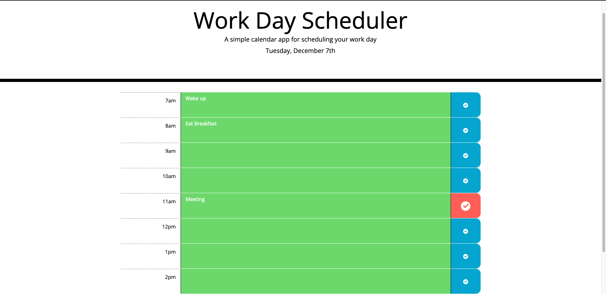

# Work Day Scheduler 

# Welcome 

Use this app to add important events to a daily planner

Manage your time effectively with these features:
- Dynamically create and edit tasks for every hour of the standard work day
- Stay updated on the current task as past, present, and future events are color coded
- Save your data so you can close the web page and come back later without losing any information

Click [here](https://yasharjs.github.io/UofTbootcamp-assignment5/) to check it out!

